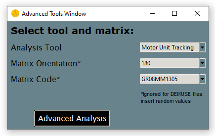
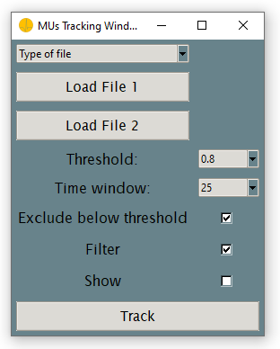
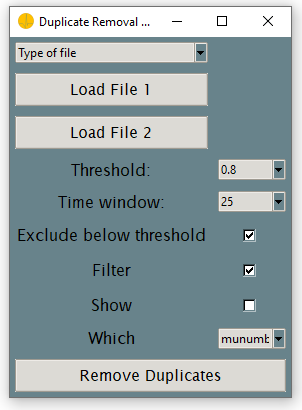
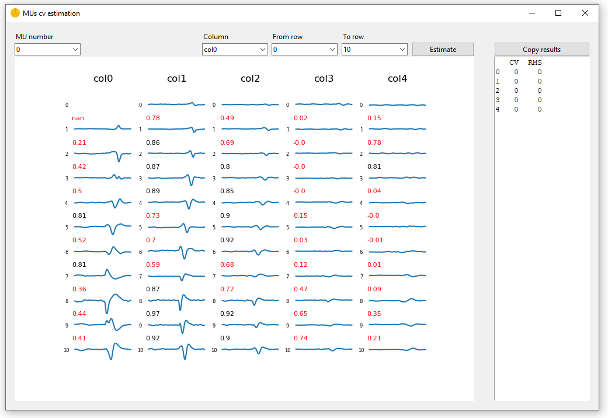

# Graphical Interface

This is the toturial for the `Advanced Tools` in the *openhdemg* GUI. Great that you made it this far! In the next few sections we will take a look at the more advanced functions implemented in the GUI. But first of all, you need to click the `Advanced Tools`button in the main window of the GUI to get to the respective adavanced analysis. The `Advanced Tools Window` will open.



So far, we have included three advanced analyses in the *openhdemg* GUI. 
- `Motor Unit Tracking`
- `Duplicate Removal`
- `Conduction Velocity Calculation`

For all of those, the specification of a `Matrix Orientation` and a `Matrix Code` is required. The `Matrix Orientaion` must match the one of your matrix during acquisition. You can find a reference image for the `Orientation` at the bottom in the right side of the `Plot Window` when using the `Plot EMG`function. The `Matrix Orientation` can be either **0** or **180** and must be chosen from the dropdown list.
The `Matrix Code` must be specified according to the one you used during acquisition. So far, the codes 
- `GR08MM1305`
- `GR04MM1305`
- `GR10MM0808`
are implemented. You must choose one from the respective dropdown list.
Keep in mind that these settings, `Matrix Code` and `Matrix Orientation`, are **ignored** when analysing `DEMUSE` files.
Once you specified these parameter, you can click the "Advaned Analysis" button to start your analysis.

-----------------------------------------

## Motor Unit Tracking
When you want to track MUs across two different files, you need to select the `Motor Unit Tracking` options and specify the `Matrix Code` and `Matrix Orentation` in the `Advanced Tools Window`. Once you clicked the `Advanced Analysis` button, the `MUs Tracking Window` will pop-up.



1. You need to specify the `Type of file` you want to track MUs across in the respective dropdown. The available filetypes are:
- `OTB` (.mat file exportable by OTBiolab+)
- `DEMUSE` (.mat file used in DEMUSE)
- `Open_HD-EMG` (emgfile or reference signal stored in .json format)
- `custom` (custom data from a .csv file)
Each filetype corresponds to a distinct datatype that shpuld match the file you want to analyse. So, select the **Type of file** corresponding to the type of your file. In case you selected `OTB` specify the `extension factor` in the dropdown.

2. Load the files according to specified `Type of file`using the `Load File 1` and `Load File 2` buttons.

3. Select the cross-correlation minimum value to consider two MUs to be the same in the `Threshold` dropdown.

4. Specify the timewindow across which you want the spike triggered average to be computed in the `Timewindow` dropdown.

5. Select whether to exclude results with cross-correlation below specified `Threshold` by ticking the `Exclude below threshold` checkbox. 

6. If you select the `Filter` checkbox, only the match with the highest cross-correlation is returned when the same MU has a match of cross-correlation > `Threshold` with multiple MUs.

7. The `Show` checkbox indicates whether to plot the spike triggered average of pairs of MUs with cross-correlation above `Threshold`.

8. By clicking the `Track` button, you can start the analysis. The tracking results will be displayed in the `MUs Tracking Resul` output in the right side of the `MUs Tracking Window`.

## Duplicate Removal
When you want to remove MU duplicates across in different files, you need to select the `Duplicate Removal` options and specify the `Matrix Code` and `Matrix Orentation` in the `Advanced Tools Window`. Once you clicked the `Advanced Analysis` button, the `Duplicate Removal Window` will pop-up. `Duplicate Removal` requires similar input as `Motor Unit Tracking`, so please take a look at the [`Motor Unit Tracking`](#motor-unit-tracking) section. However, you need to do two more things. 



1. You should specify How to remove the duplicated MUs in the `Which` dropdown. You can choose between 
- munumber: Duplicated MUs are removed from the file with more MUs.
- PNR: The MU with the lowest PNR is removed.
- SIL: The MU with the lowest SIL is removed.

2. By clicking the `Remove Duplicates` button, you start the removal process. A separate plot for each MU will appear.

3. Specify a filename and location to save the file with duplicates removed in a .json format.

## Conduction Velocity
Prior to calculation of the `Conduction Velocity` you need to load a file in the main window of the GUI. Take a look at the [intro](GUI_intro.md#specifying-an-analysis-file) section.  Once you have done this, open the `Advanced Tool Window` using the `Advanced Analaysis` button. 

1. Select `Conduction Velocity` in the `Analysis Tool` dropdown, decide on the `Matrix Orientation` and `Matrix Code` as described [above](#graphical-interface).

2. Click the `Advanced Analysis` button to start the calculation of the `Conduction Velocity`. The `MUs cv estimation` window will pop up. 



3. In the top left of the `MUs cv estimation` window select the MU for which you want to calculate the conduction velocity using the `MU Number` dropdown. 

4. In the top middle of the window select the column for which you want to calculate the conduction velocity choosing from the `Column` dropdown.

5. In the top right of the window select the rows for which you want to calculate the conduction velocity using the `From row` and `To row` dropdown. For example, if you want to calculate the conduction velocity from row 5 to 10, select 

    ```Python
    From row: 5
    To row: 10
    ```

6. Click the `Estimate` button to start the calculation for the respective column and rows. The results will be displayed on the right side of the `MUs cv estimation` window. 

7. You can copy the estimation results using the `Copy Results` button for futher analysis. 

--------------------------------------

We are now at the end of describing the advanced functions included in the *openhdemg* GUI. In case you need further clarification, don't hesitate to post a question in the Github discussion forum (LINK). Moreover, if you noticed an error that was not properly catched by the GUI, please file a bug report according to our guidelines (LINK).
If you want to take a look at more basic stuff, check out the [basic](GUI_basics.md). 


    


