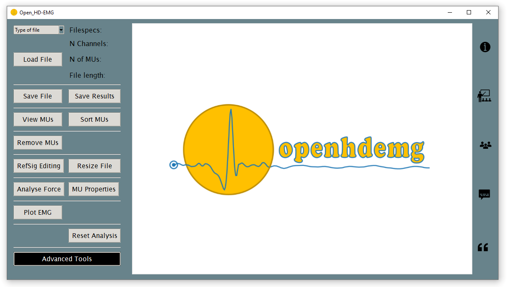

# Graphical Interface

Welcome, to the *openhdemg* Graphical Interface (GUI) introduction! 
The *openhdemg* GUI incorporates all relevant high-level functions of the *openhdemg* library. The GUI allows you to successfully perform High-Density Electromyography (HD-EMG) data anlysis **without any programming skills required**. Moreover is no downside to using the GUI even when you are an experienced programmer. 

Let us shortly walk you through the main window of the GUI. An image of the starting page of the GUI is displayed below.

This is your starting point for every analysis. On the left hand side you can find all the entryboxes and buttons relevant for the analyses you want to perform. In the middle you can see the plotting canvas where plots of the HD-EMG data analysis are displayed. On the right hand side you can find information buttons leading you directly to more information, tutorials, and more. And, with a little swoosh of magic, the results window appears at the bottom of the GUI once an analysis is finished. 

## Specifying an analysis file

1. In order to load file into the GUI, you first need to select something in the **Type of file** dropdown box at the top left corner. The available filetype are "OTB", "DEMUSE", "REFSIG", "Open_HD-EMG" and "custom". Each filetype corresponds to a distinct datatype that shpuld match the file you want to analyse. So, select the **Type of file** corresponding to the type of your file. 

2. To actually load the file, click the **Load File** button and select the file you want to analyse. In case of occurence, follow the error messages and repeat this and the previos step.

3. Once the file is successfully loaded, the specifications of the file you want to analyse will be displayed next to the **Load File** button. 

## Viewing an analysis file

1. It doesn't get any simpler than this! Load an analysis file as described in the prior section.

2. Once a file is successfully loaded, i.e. you can see the file specification displayed in the GUI, you can click the **View MUs** button to plot/view your file. In the middle section of the GUI, a plot containing your data should appear.

In the two sections above, we described the two most rudimental functions in the GUI. To learn more about basic and more advanced analysis features of the GUI, check out the "basic" and "advanced" chapters in dropdown menu on the left side of the webpage.

