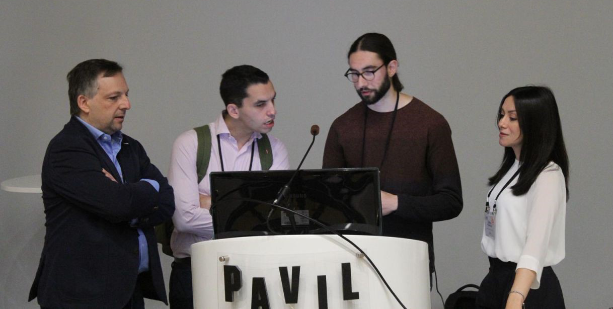

# Estimating common synaptic inputs

Are you interested in estimating common synaptic input to spinal motor neurons from motor unit spike trains?

This page collects the material associated with our new tutorial article on common synaptic input estimation using *openhdemg*. The tutorial is intended to provide a practical and reproducible workflow, from motor unit spike-train preparation to the interpretation of time-domain, frequency-domain, and network-based estimates of common synaptic input.

## Preprint article

**Estimating common synaptic inputs to spinal motor neurons from motor unit spike trains using *openhdemg*.**

*[https://doi.org/10.48550/arXiv.2606.23066](https://doi.org/10.48550/arXiv.2606.23066){:target="_blank"}*

Here you can find the preprint manuscript, open access and freely available to anybody, along with all the up-to-date material necessary to follow the tutorial article using *openhdemg*. Please keep an eye on this page. We will share the final version of the manuscript here when it becomes available.

You can download the sample files and the sample scripts [here](https://drive.google.com/drive/folders/1lxXSVTDg7eOntkmapIbGQwAvxrQY96oM?usp=sharing){:target="_blank"}. We hope you find this work useful. If that's the case, please cite it in your research; it will help us continue the development of *openhdemg*.

[Download files &nbsp; :fontawesome-solid-download:](https://drive.google.com/drive/folders/1lxXSVTDg7eOntkmapIbGQwAvxrQY96oM?usp=sharing){:target="_blank", .md-button .md-button--primary }

 

<a href="https://www.giacomovalli.com/openhdemg/online_pdfs/cabral_et_al_2026_tutorial_arxiv.pdf" target="_blank" rel="noopener noreferrer">
  <object data="https://www.giacomovalli.com/openhdemg/online_pdfs/cabral_et_al_2026_tutorial_arxiv.pdf" type="application/pdf" width="100%" height="800px">
    
Your web browser doesn't have a PDF plugin. Instead, you can click here to download the PDF file.

  </object>
</a>

  <!-- links in HTML should be full links-->

## 2026 ISEK Workshop

This tutorial article is linked to the ISEK 2026 workshop:

**From HDsEMG-based motor unit identification to coherence analysis: how to estimate the common synaptic input to spinal motor neurons.**

The workshop was designed to guide participants through a reproducible openhdemg workflow for common synaptic input analysis, from motor unit identification and spike-train validation to cumulative spike trains, smoothed discharge rates, coherence analysis, and physiological interpretation.

You can find more information and related dissemination material on the [ISEK-JEK Tutorials](isek_jek_tutorials.md) page.

 

{:target="_blank"}