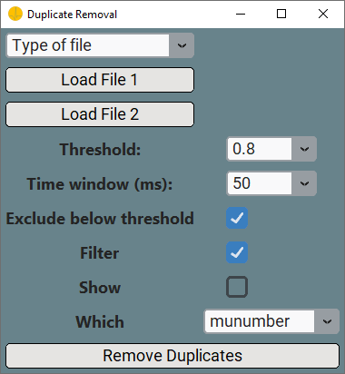
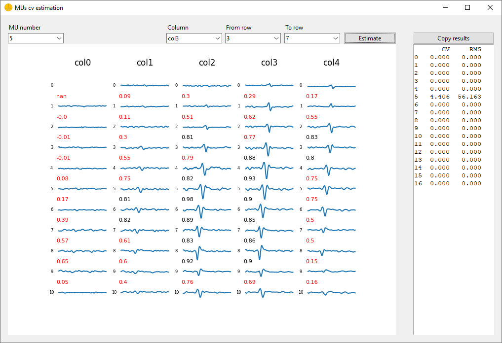

# Graphical Interface

This is the toturial for the `Advanced Tools` in the *openhdemg* GUI. Great that you made it this far! In the next few sections we will take a look at the more advanced functions implemented in the GUI. But first of all, you need to click the `Advanced Tools` button in the main window of the GUI to get to the respective adavanced analysis. The `Advanced Tools Window` will open.


Please note, the `Advanced Tools` might not be available for all the files, as some of them might not have a sufficient number of electrodes to directly perform the advanced analyses. If you want to use the advanced tools anyway, you can still do so from the library.

## Start a Specific Tool

So far, we have included four advanced analyses in the *openhdemg* GUI.

- `Motor Unit Tracking`
- `Duplicate Removal`
- `Conduction Velocity Estimation`
- `Persistent Inward Currents`

For some of these analyses, the specification of a `Matrix Code` and a `Matrix Orientation` is required.

The `Matrix Code` must be specified according to the one you used during acquisition. So far, the implemented codes are:

    - `Custom order`
    - `None`
    - `GR08MM1305`
    - `GR04MM1305`
    - `GR10MM0808`

In case you selected `Custom order`, you must also specify the custom order in the GUI settings. Please refer to [this tutorial](gui_settings.md/#electrodes) for further instructions on how to do so.

In case you selected `None`, the entrybox `Rows, Columns` will appear. Please specify the number of rows and columns of your used matrix since you now bypass included matrix codes. In example, specifying

```Python
Rows, Columns: 13, 5
```
means that your File has 65 channels organised over 13 rows and 5 columns.

The use of `None` is suggested anytime your loaded file contains already sorted EMG channels and you want to avoid further sorting.

If you selected one of the built-in sorting orders (e.g., `GR08MM1305`, `GR04MM1305`, `GR10MM0808`), you need to specify also the `Orientation` in row two and column four in the left side of the `Plot Window`. The `Orientaion` must match the one of your matrix during acquisition. You can find a reference image for the `Orientation` at the bottom in the right side of the `Plot Window`. `Orientation` is ignored when `Matrix Code` is `None` or `Custom order`.

Once you specified these parameter, you can click the `Advaned Analysis` button to start your analysis.

-----------------------------------------

## Motor Unit Tracking

When you want to track MUs across two different files, you need to select the `Motor Unit Tracking` option and specify the `Matrix Code` and `Matrix Orentation` in the `Advanced Tools Window`. Once you clicked the `Advanced Analysis` button, the `MUs Tracking Window` will pop-up.


1. You need to specify the `Type of file` you want to track MUs across in the respective dropdown. The available filetypes are:

    - `OPENHDEMG` (emgfile or reference signal stored in .json format)
    - `CUSTOMCSV` (custom data from a .csv file)
    - `OTB` (.mat file exportable by OTBiolab+)
    - `DEMUSE` (.mat file used in DEMUSE)

    Each filetype corresponds to a distinct datatype that should match the file you want to analyse. So, select the **Type of file** corresponding to the type of your file. In case you selected `OTB`, specify the `extension factor` in the dropdown.

2. Load the files according to specified `Type of file`using the `Load File 1` and `Load File 2` buttons.

3. Select the minimum cross-correlation value to consider two MUs to be the same in the `Threshold` dropdown.

4. Specify the timewindow across which you want the spike triggered average to be computed in the `Timewindow` dropdown.

5. Select whether to exclude results with cross-correlation below specified `Threshold` by ticking the `Exclude below threshold` checkbox. 

6. If you select the `Filter` checkbox, only the match with the highest cross-correlation is returned when the same MU has a match of cross-correlation > `Threshold` with multiple MUs.

7. The `Show` checkbox indicates whether to plot the spike triggered average of pairs of MUs with cross-correlation above `Threshold`.

8. By clicking the `Track` button, you can start the analysis. The tracking results will be displayed in the `MUs Tracking Result` output in the right side of the `MUs Tracking Window`.

## Duplicate Removal

When you want to remove MUs duplicates across different files, you need to select the `Duplicate Removal` options and specify the `Matrix Code` and `Matrix Orentation` in the `Advanced Tools Window`. Once you clicked the `Advanced Analysis` button, the `Duplicate Removal Window` will pop-up. `Duplicate Removal` requires similar input as `Motor Unit Tracking`, so please take a look at the [`Motor Unit Tracking`](#motor-unit-tracking) section. However, you need to do two more things. 



1. You should specify How to remove the duplicated MUs in the `Which` dropdown. You can choose between

    - munumber: Duplicated MUs are removed from the file with more MUs.
    - accuracy: The MU with the lowest accuracy score is removed.

2. By clicking the `Remove Duplicates` button, you start the removal process.

3. Specify a filename and location to save the file(s) with duplicates removed in a .json format.

## Conduction Velocity
Prior to calculation of the `Conduction Velocity` you need to load a file in the main window of the GUI. Take a look at the [intro](gui_intro.md#specifying-an-analysis-file) section.  Once you have done this, open the `Advanced Tool Window` using the `Advanced Analaysis` button. 

1. Select `Conduction Velocity` in the `Analysis Tool` dropdown, decide on the `Matrix Orientation` and `Matrix Code` as described [above](#graphical-interface).

2. Click the `Advanced Analysis` button to start the calculation of the `Conduction Velocity`. The `MUs cv estimation` window will pop up. 

    

3. In the top left of the `MUs cv estimation` window select the MU for which you want to calculate the conduction velocity using the `MU Number` dropdown. 

4. In the top middle of the window select the column for which you want to calculate the conduction velocity choosing from the `Column` dropdown.

5. In the top right of the window select the rows for which you want to calculate the conduction velocity using the `From row` and `To row` dropdown. For example, if you want to calculate the conduction velocity from row 3 to 7, select 

    ```Python
    From row: 3
    To row: 7
    ```

6. Click the `Estimate` button to start the calculation for the respective column and rows. The results will be displayed on the right side of the `MUs cv estimation` window. 

7. You can copy the estimation results using the `Copy Results` button for futher analysis. The results are copied in the clipboard and can be pasted into any .csv (Excel). 

--------------------------------------

We are now at the end of describing the advanced functions included in the *openhdemg* GUI. If you want to take a look at more basic stuff, check out the [basic](gui_basics.md).

## Persistent Inward Currents

When you want to estimate Persistent Inward Currents, you need to select the `Persistent Inward Currents` option. In this case, `Matrix Code` and `Matrix Orentation` will be locked, as these are not needed for the analysis. Once you clicked the `Advanced Analysis` button, the `Persistent Inward Currents Window` will pop-up.


Please note that it is suggested to [sort the MUs](gui_basics.md/#motor-unit-sorting) based on recruitment order before performing the PICs estimation. This can be done in the main GUI window.

1. In row 1 of this window you can select the smoothing tecnique to adopt (at the time of writing, only the `Support Vector Regression` is available, but more are under development).

2. Select the `Average Method` to use for test MU deltaF value.

3. Select the method for deltaF  `Normalisation`.

4. Select the `Clean` option if you want to remove values that do not meet exclusion criteria.

5. By clicking the `Compute PIC` button, you can start the analysis. The results will be displayed in the right side of the `Persistent Inward Currents Window`.

## More questions?

We hope that this tutorial was useful. If you need any additional information, do not hesitate to read the answers or ask a question in the [*openhdemg* discussion section](https://github.com/GiacomoValliPhD/openhdemg/discussions){:target="_blank"}. If you are not familiar with GitHub discussions, please read this [post](https://github.com/GiacomoValliPhD/openhdemg/discussions/42){:target="_blank"}. This will allow the *openhdemg* community to answer your questions.

Moreover, if you noticed an error that was not properly catched by the GUI, please [report the issue](https://github.com/GiacomoValliPhD/openhdemg/issues){:target="_blank"}.
