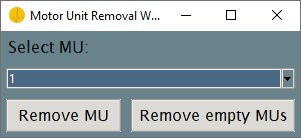
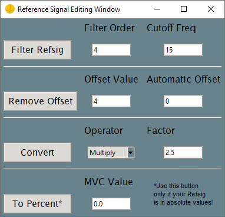
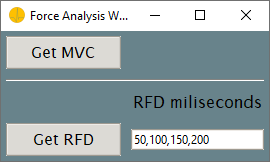
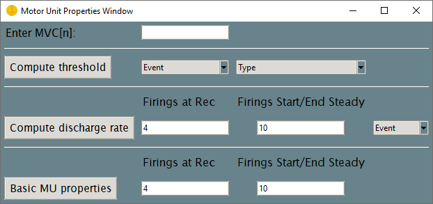
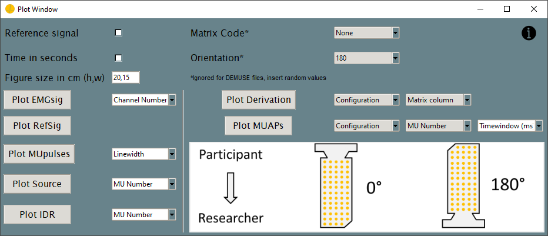

# Graphical Interface

This is the basic introduction to the *openhdemg* GUI. In the next few sections, we will go through the basic analysis functions embedded in the GUI. For the advanced stuff, take a look at the [advanced](gui_advanced.md) chapter. We will start with how to sort the motor units (MUs) included in your analysis file, go over force and MU property analysis, take a detour on plotting, and take a look at how to save and reset your analysis. Have fun!

--------------------------------------------

## Motor Unit Sorting
To sort the MUs included in your analysis file in order of their recruitement, we implemented a sorting algorithm. The MUs are sorted based on their recruitement order in an ascending manner.

1. Load a file. Take a look at the [intro](gui_intro.md#specifying-an-analysis-file) section on how to do so.

2. Pay attention to view the MUs first, using the `View MUs` button (we explained this button in the [intro](gui_intro.md) chapter). The MUs will be sorted anyways, but without viewing them you won't see what is happening. 

3. On the left hand side in the main window of the GUI, you can find the `Sort MUs` button. It is located in row three, column two. Once you press the button, the MUs will be sorted. 

## Remove Motor Units
To remove MUs included in your analysis file, you can click the `Remove MUs` button. The button is located on the left hand side in the main window of the GUI in column one of row four.



1. View the MUs using the `View MUs` button prior to MU removal, you can directly see what is happening.

2. Click the `Remove MUs` button, and a file is loaded, a pop-up window will open. 

3. Select the MU you want to delete from the analysis file from the `Select MU:`dropdown.

    ```Python
    Select MU: 1
    ```
    will result in the second MU to be deleted (Python is base 0).

4. Click the `Remove MU` button to remove the MU. 

## Reference Signal Editing
The *openhdemg* GUI also allows you to edit and filter reference signals corresponding to your analysis file (this can be either a file containing both the MUs and the reference signal or a file containing only the reference signal).



1. View the MUs using the `View MUs` button prior to reference signal editing, so you can see what is happening.

2. Click the `RefSig Editing` button located in row five and column one, a new pop-up window opens. In the `Reference Signal Editing Window`, you can low-pass filter the reference signal as well as remove any signal offset. Additionally, you can also convert your reference signal by a specific factor (amplification factor) or convert it from absolute to percentage (relative or normalised) values.

3. When you click the `Filter RefSig` button, the reference signal is low-pass filtered (Zero-lag, Butterworth) according to values specified in the `Filter Order` and `Cutoff Freq` textboxes. In example, specifiying 

    ```Python
    Filter Order: 4
    Cutoff Freq: 15
    ```
    will allow only frequencies below 15 Hz to pass trough. The filter order of 4 indicates a fourth degree polynomial transfer function.

4. When you click the `Remove Offset` button, the reference signal's offset will be removed according to the values specified in the `Offset Value` and `Automatic Offset` textboxes. In example, specifying

    ```Python
    Offset Value : 4
    Automatic: 0
    ```
    will result in an offset correction by -4 in y-axis direction. Furthermore, specifying

    ```Python
    Offset Value : 0
    Automatic: != 0
    ```
    will result in automatic offset removal. In this case, the offset value is determined as the mean value of n samples at the beginning of the contraction (where n is equal to the value passed to Automatic). Moreover, specifying

    ```Python
    Offset Value : 0
    Automatic: 0
    ```
    will allow you to manually correct the offset in a new pop-up plot. You just need to follow the instructions on the plot.

5. When you click the `Convert` button, the reference signal will be multiplied or divided (depending on `Operator`) by the `Factor`. In example, specifying

    ```Python
    Operator : "Multiply"
    Factor: 2.5
    ```
    will amplify the reference signal 2.5 times.

6. When you click the `To Percent` button, the reference signal in absolute values is converted to percentage (relative or normalised) values based on the provided `MVC Value`. **This step should be performed before any analysis, because *openhdemg* is designed to work with a normalised reference signal.** In example, a file with a reference signal in absolute values ranging from 0 to 100 will be normalised from 0 to 20 if

    ```Python
    MVC Value : 500
    ```

## Resize EMG File
Sometimes, resizing of your analysis file is unevitable. Luckily, *openhdemg* provides an easy solution. In row five and column two in the left side of the GUI, you can find the `Resize File` button. 


1. View the MUs using the `View MUs` button prior to file resizing, you can directly see what is happening.

2. Clicking the `Resize File` button will open a new pop-up plot of your analysis file. 

3. Follow the instructions in the plot to resize the file. Simply click in the signal twice (once for start-point, once for end-point) to specify the resizing region and press enter to confirm your coice.

## Analyse Force Signal
In order to analyse the force signal in your analysis file, you can press the `Analyse Force` button located in row six and column one in the left side of the GUI. A new pop-up window will open where you can analyse the maximum voluntary contraction (MVC) value as well as the rate of force development (RFD). 



### Maximum voluntary contraction
1. In order to get the MVC value, simply press the `Get MVC` button. A pop-up plot opens and you can select the area where you suspect the MVC to be. 
2. Click once to specify the start-point and once to specify the end-point. 
3. Press enter to confirm you choice. You will then see a `Result Output` appearing at the bottom of the main window of the GUI. There you can find the actual result of your MVC analysis. 
4. You can edit or copy any value in the `Result Output`, however, you need to close the top-level `Force Analysis Window` first.

### Rate Of Force Development
1. To calculate the RFD values you can press the `Get RFD` button. 
2. A pop-up plot appears and you need to specify the starting point of the rise in the force signal by clicking and subsequenlty pressing enter. 
3. The respective RFD values between the stated timepoint ranges (ms) in the `RFD miliseconds` textinput are displayed in the `Result Output`. In example, specifying
    
    ```Python
    RFD miliseconds: 50,100,150,200
    ```
    will result in RFD value calculation between the intervals 0-50ms, 50-100ms, 100-150ms and 150-200ms. You can also specify less or more values in the `RFD miliseconds` textbox. 

4. You can edit or copy any value in the `Result Output`, however, you need to close the top-level `Force Analysis Window` first.

## Motor Unit Properties
When you press the `MU Properties` button in row six and column two, the `Motor Unit Properties` Window will pop up. In this window, you have the option to analyse several MUs propierties such as the MUs recruitement threshold or the MUs discharge rate. 



1. Specify your priorly calculated MVC in the `Enter MVC [N]:` textbox, like

    ```Python
    Enter MVC [N]: 424
    ```

### Compute Motor Unit Threshold
Subsequently to specifying the MVC, you can compute the MUs recruitement threshold by specifying the respective event and type in the `Event` and `Type` dropdown list. 

1. Specify the `Event` dropdown and choose: 
    
    ```
    "rt_dert" : Both recruitment and derecruitment thresholds will be calculated.
    "rt" : Only recruitment thresholds will be calculated.
    "dert" : Only derecruitment thresholds will be calculated.
    ```

2. Specify the `Type` dropdown and choose:
    
    ```
    "abs_rel" : Both absolute and relative thresholds will be calculated.
    "rel" : Only relative thresholds will be calculated.
    "abs" : Only absolute thresholds will be calculated.
    ```

3. Once you click the `Compute threshold` button, the recruitement threshold will be computed. 
4. The recruitement threshold for each inluded MU in the analysis file will be displayed in the `Result Output` of the GUI.
5. You can edit or copy any value in the `Result Output`, however, you need to close the top-level `Motor Unit Properties Window` first.

### Compute Motor Unit Discharge Rate
Subsequently to specifying the MVC, you can compute the MUs discharge rate by entering the respective firing rates and event.

1. Specify the number of firings at recruitment and derecruitment to consider for the calculation in the `Firings at Rec` textbox. 
2. Enter the number of firings over which to calculate the DR at the start and end of the steady-state phase in the `Firings Start/End Steady` textbox.
    
    For example:
    ```Python
    Firings at Rec: 4
    Firings Start/End Steady: 10
    ```

3. Lastly you need to specify the computation `Event`. From the `Event` dropdown list, you can choose:
    
    ```
    "rec_derec_steady" : Discharge rate is calculated at recruitment, derecruitment and during the steady-state phase.
    "rec" : Discharge rate is calculated at recruitment.
    "derec" : Discharge rate is calculated at derecruitment.
    "rec_derec" : Discharge rate is calculated at recruitment and derecruitment.
    "steady" : Discharge rate is calculated during the steady-state phase.
    ```

4. Once you press the `Compute discharge rate` button, the discharge rate will be calculated. 
5. The discharge rate for each inluded MU in the analysis file at the stated event as well a for all the contraction will be displayed in the `Result Output` of the GUI. 
6. You can edit or copy any value in the `Result Output`, however, you need to close the top-level `Motor Unit Properties Window` first.

### Basic Motor Unit Properties
Subsequently to specifying the MVC, you can calculate a number of basic MUs properties with one click. These include

- The absolute/relative recruitment/derecruitment thresholds
- The discharge rate at recruitment, derecruitment, during the steady-state phase and during the entire contraction
- The coefficient of variation of interspike interval
- The coefficient of variation of force signal

and are all displayed in the `Result Output` once the analysis in completed. 

1. Specify the number of firings at recruitment and derecruitment to consider for the calculation in the `Firings at Rec` textbox. 
2. Enter the start and end point (in samples) of the steady-state phase in the `Firings Start/End Steady` textbox. For example, 

    ```Python
    Firings at Rec: 4
    Firings Start/End Steady: 10
    ```

3. The basic MUs properties will be displayed in the `Result Output` of the GUI. 
4. You can edit or copy any value in the `Result Output`, however, you need to close the top-level `Motor Unit Properties Window` first.

## Plot Motor Units
In *openhdemg* we have implemented options to plot your analysis file ... a lot of options!
Upon clicking the `Plot MUs` button, the `Plot Window` will pop up. In the top right corner of the window, you can find an information button forwarding you directly to some tutorials. 



You can choose between the follwing plotting options:

- Plot the raw emg signal. Single or multiple channels. (Plot EMGSig)
- Plot the reference signal. (Plot RefSig)
- Plot all the MUs pulses (binary representation of the firings time). (Plot MUPulses)
- Plot the decomposed source. (Plot Source)
- Plot the instantaneous discharge rate (IDR). (Plot IDR)
- Plot the differential derivation of the raw emg signal by matrix column. (Plot Derivation)
- Plot motor unit action potentials (MUAPs) obtained from spike-triggered average from one or multiple MUs. (Plot MUAPs)

Prior to plotting you can **optionally** select a few options on the left side of the `Plot Window`. 

1. When you want the reference signal to be displayed in the plots you can select the `Reference Signal` checkbox in row one and column two in the left side of the `Plot Window`. 
2. You can specify wheter you want the x-axis of the plots to be scaled in seconds by selecting the `Time in seconds` checkbox in row two and column two in the left side of the `Plot Window`. 
3. You can change the size of the plot as well, by inputting your prefered height and width in the `Figure in size in cm (h,w)` textbox in row three and column two in the left side of the `Plot Window`. For example, if you want your plot to have a height of 6 and a width of 8, your input should look like this

    ```Python
    Figure in size in cm (h,w): 6,8
    ```

These three setting options are universally used in all plots. There are two more specification options on the right side of the `Plot Window` only relevant when using the `Plot Derivation` or `Plot MUAP` buttons. 

1. The `Matrix Code` must be specified in row one and column four in the right side of the `Plot Window` according to the one you used during acquisition. So far, implemented codes are:
    - `GR08MM1305`
    - `GR04MM1305`
    - `GR10MM0808`
    - `None`

    In case you selected `None`, the entrybox `Rows, Columns` will appear. Please specify the number of rows and columns of your used matrix since you now bypass included matrix codes. In example, specifying
    ```Python
    Rows, Columns: 13, 5
    ```
    means that your File has 65 channels.

2. You need to specify the `Orientation` in row two and column four in the left side of the `Plot Window`. The `Orientaion` must match the one of your matrix during acquisition. You can find a reference image for the `Orientation` at the bottom in the right side of the `Plot Window`.

### Plot Raw EMG Signal
1. Click the `Plot EMGsig` button in row four and column one in the left side of the `Plot Window`, to plot the raw emg signal of your analysis file. 
2. Enter or select a `Channel Number` in / from the dropdown list. For example, if you want to plot `Channel Number` one enter *0* in the dropdown. If you want to plot `Channel Numbers` one, two and three enter *0,1,2* in the dropdown. 
3. Once you have clicked the `Plot EMGsig` button, a pop-up plot will appear. 

### Plot Reference Signal 
1. Click the `Plot RefSig` button in row five and column one in the left side of the `Plot Window`, to plot the reference signal. 
2. Once you have clicked the `Plot RefSig` button, a pop-up plot will appear. 

### Plot Motor Unit Pulses
1. Click the `Plot MUpulses` button in row six and column one in the left side of the `Plot Window`, to plot the single pulses of the MUs in your analysis file.
2. Enter/select a pulse `Linewidth` in/from the dropdown list. For example, if you want to use a `Linewidth` of one, enter *1* in the dropdown. 
3. Once you have clicked the `Plot MUpulses` button, a pop-up plot will appear. 

### Plot the Decomposed Source
1. Click the `Plot Source` button in row seven and column one in the left side of the `Plot Window`, to plot the Source of the decomposed MUs in your analysis file. 
2. Enter/select a `MU Number` in/from the dropdown list. For example, if you want to plot the source for `MU Number` one enter *0* in the dropdown. If you want to plot the sources for `MU Number` one, two and three enter *0,1,2,* in the dropdown. You can also set `MU Number` to "all" to plot the sources for all included MUs in the analysis file.
3. Once you have clicked the `Plot Source` button, a pop-up plot will appear. 

### Plot Instanteous Discharge rate
1. Click the `Plot IDR` button in row eight and column one in the left side of the `Plot Window`, to plot the IDR of the MUs in your analysis file. 
2. Enter/select a `MU Number` in/from the dropdown list. For example, if you want to plot the IDR of `MU Number` one enter *0* in the dropdown. If you want to plot the IDR of `MU Number` one, two and three enter *0,1,2* in the dropdown. You can also set `MU Number` to "all" to plot the IDR of all included MUs in the analysis file.
3. Once you have clicked the `Plot IDR` button, a pop-up plot will appear. 

### Plot Differential Derivation
1. Click the `Plot Derivation` button in row four and column three in the right side of the `Plot Window`, to plot the differential derivation of the MUs in your analysis file. 
2. Specify the `Configuration` for the calculation first. You can choose from:
    - `Single differential` (Calculate single differential of raw signal on matrix rows)
    - `Double differential`(Calculate double differential of raw signal on matrix rows)
3. Specify the respective `Matrix Column` you want to plot. You can choose one from the `Matrix Column` dropdown list. 
4. Once you have clicked the `Plot Derivation` button, a new pop-up plot appears. 

### Plot Motor Unit Action Potentials
1. Click the `Plot MUAPs` button in row five and column three in the right side of the `Plot Window`, you can plot the action potential of the MUs in your analysis file. 
2. Specify the `Configuration` for  calculation first. You can choose from:
    - `Monopolar`
    - `Single differential` (Calculate single differential of raw signal on matrix rows)
    - `Double differential`(Calculate double differential of raw signal on matrix rows)
3. Specify the respective `MU Number` you want to plot. You can choose one from the `MU Number` dropdown list. 
4. Specify the `Timewindow` of the plots. You can choose from the `Timewindow` dropdown list or enter any integer. 
5. Once you have clicked the `Plot MUAPs` button, a new pop-up plot appears. 

## Saving Your Analysis File 
Subsequently to analysing your emg-file in the *openhdemg* GUI, it is beneficial to save it. Otherwise, all changes will be lost when the GUI is closed. 

1. Click the `Save File` button in row two and column two in the left side of the main window. 
2. Specify a filename and a location and confirm! That's it!

## Saving Your Analysis Results
Some analyses included in the *openhdemg* GUI return values that are displayed in the `Result Output` of the GUI. Of course, you can simply copy-paste them, but it might be more convenient to directly save your analysis results. Additionally, all the values in the `Results Output` will be overwritten by new analyses or deleted in case of closing the GUI. 

1. click the `Save Results` button in row two and column two in the left side of the main window. 
2. Specify a location where to save the file and confirm. You can find the file there with the name of your analysis file. 

## Resetting Your Analysis 
We all make mistakes! But, most likely, we are also able to correct them. In case you have made a mistake in the analysis of you emg-file in the *openhdemg* GUI, we have implemented a reset button for you. Click the `Reset Analysis` button in row eight and column two in the lef side of the main window to  reset any analysis you previously performed since opening the GUI and inputting an analysis file. Your analysis file is reset to the original file and all the changes are discarded. So, no need to be perfect!

--------------------------------------------

If you want to proceed to the advanced stuff now, take a look at the [advanced](gui_advanced.md) tab on the left side of the webpage.

## More questions?

We hope that this tutorial was useful. If you need any additional information, do not hesitate to read the answers or ask a question in the [*openhdemg* discussion section](https://github.com/GiacomoValliPhD/openhdemg/discussions){:target="_blank"}. If you are not familiar with GitHub discussions, please read this [post](https://github.com/GiacomoValliPhD/openhdemg/discussions/42){:target="_blank"}. This will allow the *openhdemg* community to answer your questions.

Moreover, if you noticed an error that was not properly catched by the GUI, please [report the issue](https://github.com/GiacomoValliPhD/openhdemg/issues){:target="_blank"}.
