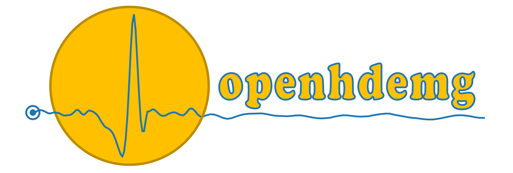

# Welcome to openhdemg
<p align="left">
    <a href="https://pypi.python.org/pypi/openhdemg/0.1.2/" alt="openhdemg version" target="_blank">
        </a>
    <a href="https://pypi.org/project/openhdemg/0.1.2/" alt="Python version" target="_blank">
        </a>
    <a href="https://www.youtube.com/@openhdemg" alt="YouTube" target="_blank">
        </a>
    <a href="https://twitter.com/openhdemg" alt="Twitter" target="_blank">
        </a>
</p>

<br/>



<br/>

## Overview

*openhdemg is a powerful toolbox for the analysis of HD-EMG recordings.*

*openhdemg* is an open-source framework written in Python 3 with many functionalities specifically designed for the analysis of High-Density Electromyography (HD-EMG) recordings. Some of its main features are listed below, but there is much more to discover! For a full list of available functions, please refer to the **API reference** section.

1. **Load** decomposed HD-EMG files from various sources, such as .mat and .csv files. This allows to interface *openhdemg* with the commonly used softwares like OTBioLab+, DEMUSE, Delsys NeuroMap and potentially with any other software.
2. **Visualise** your EMG or force/reference signal, as well as the motor units' firing times and their action potentials shape.
3. **Edit** your file changing the reference signal offset, filtering noise, calculating differential derivations and removing unwanted motor units.
4. **Analyse** motor units' recruitment/derecruitment thresholds, discharge rate, conduction velocity, action potentials amplitude and more...
5. **Remove duplicates** between different files from the same recording session and analyse them together to increase the number of motor units'.
6. **Track** motor units' across different recording sessions.
7. **Save** the results of the analyses and the edited file.

## Start immediately
If you already know how to use Python, that's the way to go! Otherwise, have a look at the tutorial explaining how to [Setup your Python environment](tutorials/setup_working_env.md).

*openhdemg* can be easily installed using pip:

```shell
pip install openhdemg
```

If you want an overview of what you can do with the *openhdemg* library, have a look at the [Quick Start](quick-start.md) section and then explore all the functions in the **API reference**.

## Good to know
In addition to the rich set of modules and functions presented in the **API reference**, *openhdemg* offers also a practical graphical user interface (GUI) from which many tasks can be performed without writing a single line of code!

After installing the *openhdemg* package, the GUI can be simply accessed from the command line (check to be into the virtual environment) with:

```shell
python -m openhdemg.gui.openhdemg_gui
```

Once opened, it will look like this. It is cool, isn't it?


## Why openhdemg
The *openhdemg* project was born in 2022 with the aim to provide the HD-EMG community with a free and open-source framework to analyse motor units' properties.

The field of EMG analysis in humans has always been characterized by a lack of available software for signal post-processing and analysis. This has forced users to code their own scripts, which can lead to problems when the scripts are not shared open-source. Why?

- If different users use different scripts, the results can differ.
- Any code can contain errors, if the code is not shared, the errors will never be known and them will repeat in the following analyses.
- There is a significant difference between the methods presented in research papers and the practical implementation of a script. Reproducing a script solely based on written instructions can be challenging, making the reproducibility of a study unrealistic.
- Anyone who doesn't code, will not be able to analyse the recordings.

In order to overcome these problems, we developed a fully transparent framework for the analysis of motor units' properties.

This project is intended for the users that already know the Python language, for those willing to learn it and even for those not interested in coding, thanks to a friendly graphical user interface (GUI).

Both the *openhdemg* project and its contributors adhere to the Open Science Principles and especially to the idea of public release  of data and other scientific resources necessary for conducting honest research.
