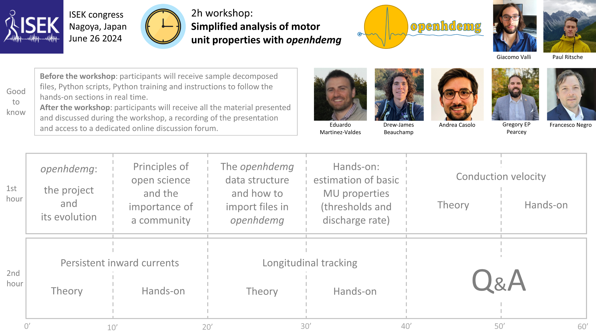

# ISEK-JEK Tutorials

Welcome to the page dedicated to our dissemination activity with the International Society of Electrophysiology and Kinesiology (ISEK) and the Journal of Electromyography and Kinesiology (JEK).

 

## JEK Tutorial article

**Tutorial: analysis of central and peripheral motor unit properties from decomposed High-Density surface EMG signals with *openhdemg*.**

*[https://doi.org/10.1016/j.jelekin.2023.102850](https://doi.org/10.1016/j.jelekin.2023.102850){:target="_blank"}*

Here you can find the manuscript, published open access and freely available to anybody, along with all the up-to-date material necessary to follow the tutorial article using *openhdemg*.

You can download the sample files and the sample scripts [here](https://drive.google.com/drive/folders/1lxXSVTDg7eOntkmapIbGQwAvxrQY96oM?usp=sharing){:target="_blank"}. We hope you find this work useful. If that's the case, please cite it in your research; it will help us continue the development of *openhdemg*.

[Dowload files &nbsp; :fontawesome-solid-download:](https://drive.google.com/drive/folders/1lxXSVTDg7eOntkmapIbGQwAvxrQY96oM?usp=sharing){:target="_blank", .md-button .md-button--primary }

 

<a href="https://www.giacomovalli.com/openhdemg/online_pdfs/valli_et_al_2023_tutorial_jek.pdf" target="_blank" rel="noopener noreferrer">
  <object data="https://www.giacomovalli.com/openhdemg/online_pdfs/valli_et_al_2023_tutorial_jek.pdf" type="application/pdf" width="100%" height="800px">
    
Your web browser doesn't have a PDF plugin. Instead, you can click here to download the PDF file.

  </object>
</a>

  <!-- links in HTML should be full links-->

## 2024 ISEK Workshop

**Workshop: Simplified analysis of motor unit properties with *openhdemg*.**

On the 26th of June 2024, we will present the *openhdemg* framework at the [ISEK congress](https://isek.org/workshops/){:target="_blank"}, which will be held in Nagoya, Japan.

Below, you can find a preliminary design of the workshop and the fantastic speakers who will participate. We look forward to seeing you there!

More info will come soon.

 

*Click on the image for full-screen mode*

{:target="_blank"}

