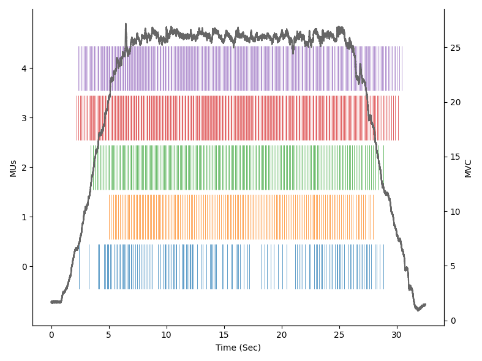

Let's implement together, step-by-step, a script to analyse all the relevant motor units' (MUs) properties.

In particular, we will go through:

1. **Install** *opendemg*
2. **Load** a file
3. **Visualise** the content of the file
4. **Edit** the reference signal
5. **Remove** unwanted MUs
6. **Analyse** fundamental MUs properties
7. **Save** the edited file and the results of the analysis

## 1. Install

*openhdemg* can be easily installed using pip:

```shell
pip install openhdemg
```

or conda:

```shell
conda install -c conda-forge openhdemg
```

Once the installation of *openhdemg* is succesfull, you can install all the required packages from the reqirements.txt file.

## 2. Load a file

Before calling the functions contained in the *openhdemg* library, we need to import it. This can be done as:

```Python
import openhdemg.library as emg
```

Great, we are now ready to exploit all the functionalities of the library!

<br>

In this example, we will use the sample file provided with *openhdemg*.

This can be simply loaded calling the function [emg_from_samplefile](api_openfiles.md#openhdemg.library.openfiles.emg_from_samplefile).

```Python
# Import the library with the short name 'emg'
import openhdemg.library as emg

# Load the sample file
emgfile = emg.emg_from_samplefile()
```

*emgfile* is organised as a Python dictionary and contains different elements (which are labelled by keys).

For a full list of keys contained in the *emgfile* refer to the [openfiles documentation](api_openfiles.md#notes).

Each element in the emgfile can be accessed as `emgfile["element"]`.

So, if we want to access, for example, the reference signal, we can use `emgfile["REF_SIGNAL"]`.

## 3. Visualise the content of the file

Now that we loaded the *emgfile*, we can inspect its content.

As we said above, there are different elements in the *emgfile* and we can visualise both their type and their content with 2 lines of code:

```Python
# Import the library with the short name 'emg'
import openhdemg.library as emg

# Load the sample file
emgfile = emg.emg_from_samplefile()

# Print type
print(type(emgfile["REF_SIGNAL"]))

# Print content
print(emgfile["REF_SIGNAL"])


""" Output
<class 'pandas.core.frame.DataFrame'>
              0
0     -0.159466
1     -0.139630
2     -0.099957
3     -0.080121
4     -0.060284
...         ...
66555 -0.337994
66556 -0.318158
66557 -0.298321
66558 -0.318158
66559 -0.318158
"""
```

As you can see from the printed output, the reference signal is contained in a pandas DataFrame with 1 column (column 0).

This is an extremely important information if you want to manipulate the content of the emgfile although it is outside the scope of this Quick-Start tutorial.

Apart from accessing the numerical values, we can also plot them.

In this case we are interested in visualising the MUs firing times together with the reference signal. This can be done with the function [plot_mupulses](api_plotemg.md#openhdemg.library.plotemg.plot_mupulses).

```Python
# Import the library with the short name 'emg'
import openhdemg.library as emg

# Load the sample file
emgfile = emg.emg_from_samplefile()

# Plot MUs firing times and ref signal
emg.plot_mupulses(emgfile=emgfile)
```



Looks good, but I would rather have the MUs ordered by recruitment order and also with thinner lines!

We can do that with the function [sort_mus](api_tools.md#openhdemg.library.tools.sort_mus) and changing the parameters in [plot_mupulses](api_plotemg.md#openhdemg.library.plotemg.plot_mupulses).

```Python
# Import the library with the short name 'emg'
import openhdemg.library as emg

# Load the sample file
emgfile = emg.emg_from_samplefile()

# Sort MUs based on recruitment order
emgfile = emg.sort_mus(emgfile=emgfile)

# Plot MUs firing times and ref signal
emg.plot_mupulses(emgfile=emgfile, linewidths=0.4)
```


<br>

Are you curious about the dicharge rate of the MUs? You can view that with the function [plot_idr](api_plotemg.md#openhdemg.library.plotemg.plot_idr).

```Python
# Import the library with the short name 'emg'
import openhdemg.library as emg

# Load the sample file
emgfile = emg.emg_from_samplefile()

# Sort MUs based on recruitment order
emgfile = emg.sort_mus(emgfile=emgfile)

# Plot MUs instantaneous discharge rate
emg.plot_idr(emgfile=emgfile)
```


## 4. Edit the reference signal

The MUs look quite good; however, the reference signal is a bit noisy and the offset is not to 0.

The noise can be removed filtering the reference signal with the function [filter_refsig](api_tools.md#openhdemg.library.tools.filter_refsig) that, by default, applies a 4th order, zero-lag, low-pass Butterworth filter with a cutoff frequency of 15 Hz.

Instead, the offset can be removed with the function [remove_offset](api_tools.md#openhdemg.library.tools.remove_offset) that automatically detects the offset based on a number of samples at the beginning of the recording.

```Python
# Import the library with the short name 'emg'
import openhdemg.library as emg

# Load the sample file
emgfile = emg.emg_from_samplefile()

# Sort MUs based on recruitment order
emgfile = emg.sort_mus(emgfile=emgfile)

# Filter the ref signal
emgfile = emg.filter_refsig(emgfile=emgfile)

# Remove the offset based on the first 1024 samples (that corresponds to 0.5
# seconds when sampling the signal at 2048 Hz).
emgfile = emg.remove_offset(emgfile=emgfile, auto=1024)

# Plot MUs instantaneous discharge rate
emg.plot_idr(emgfile=emgfile)
```


## 5. Remove unwanted MUs

There might be cases in which we need to remove one or more MUs from our *emgfile*.

From the visual inspection of our plots, we can see that the firings pattern of MU number 2 (remember, Python is in base 0!!!) is not really regular. We might therefore have doubts about its quality.

A way to assess the quality of the MUs is to look at the separation between the signal and the noise. This is efficiently measured by accuracy scores.

This score is automatically calculated while importing the *emgfile* and can be easily accessed as `emgfile["ACCURACY"]`. In our sample file, the accuracy is calculated by the Silhouette (SIL) score (Negro 2016).

```Python
# Import the library with the short name 'emg'
import openhdemg.library as emg

# Load the sample file
emgfile = emg.emg_from_samplefile()

# Print the SIL score
print(emgfile["ACCURACY"])

"""Output
          0
0  0.899082
1  0.919601
2  0.879079
3  0.917190
4  0.955819
"""
```

Our suspicion was right, MU number 2 has the lowest accuracy score.

In order to remove this MU, we can use the function [delete_mus](api_tools.md#openhdemg.library.tools.delete_mus).

```Python
# Import the library with the short name 'emg'
import openhdemg.library as emg

# Load the sample file
emgfile = emg.emg_from_samplefile()

# Sort MUs based on recruitment order
emgfile = emg.sort_mus(emgfile=emgfile)

# Filter the ref signal
emgfile = emg.filter_refsig(emgfile=emgfile)

# Remove the offset based on the first 1024 samples (that corresponds to 0.5
# seconds when sampling the signal at 2048 Hz).
emgfile = emg.remove_offset(emgfile=emgfile, auto=1024)

# Remove MU number 2
emgfile = emg.delete_mus(emgfile=emgfile, munumber=2)

# Plot MUs instantaneous discharge rate
emg.plot_idr(emgfile=emgfile)
```


## 6. Analyse fundamental MUs properties

Now that we removed the unwanted MUs and adjusted the reference signal, we can proceed with the analysis of some fundamental MUs properties like the thresholds of recruitment and derecruitment and the discharge rate.

In the past, this used to require many lines of code, but thanks to *openhdemg*, we can now do that with 1 line of code using the function [basic_mus_properties](api_analysis.md#openhdemg.library.analysis.basic_mus_properties).

After calling the function [basic_mus_properties](api_analysis.md#openhdemg.library.analysis.basic_mus_properties), the user will be asked to select the start and the end of the steady-state phase. This can be done positioning the mouse on the desired point and then pressing a keybord key (such as 'a'). To remove points, right click with your mouse.

```Python
# Import the library with the short name 'emg'
import openhdemg.library as emg

# Load the sample file
emgfile = emg.emg_from_samplefile()

# Sort MUs based on recruitment order
emgfile = emg.sort_mus(emgfile=emgfile)

# Filter the ref signal
emgfile = emg.filter_refsig(emgfile=emgfile)

# Remove the offset based on the first 1024 samples (that corresponds to 0.5
# seconds when sampling the signal at 2048 Hz).
emgfile = emg.remove_offset(emgfile=emgfile, auto=1024)

# Remove MU number 2
emgfile = emg.delete_mus(emgfile=emgfile, munumber=2)

# Calculate all the basic MUs propertis.
# Specify maximum voluntary contraction in Newtons.
results = emg.basic_mus_properties(
    emgfile=emgfile,
    mvc=634,
)

print(results)

"""
     MVC  MU_number  ACCURACY  avg_ACCURACY      abs_RT    abs_DERT  \
0  634.0          0  0.899082      0.922923   30.621759   36.168135  
1    NaN          1  0.919601           NaN   32.427026   31.167703  
2    NaN          2  0.917190           NaN   68.371911   67.308703  
3    NaN          3  0.955819           NaN  118.504004  102.761472  

       rel_RT   rel_DERT    DR_rec  DR_derec  DR_start_steady  DR_end_steady  \
0    4.829930   5.704753  7.548770  5.449581        11.788779      10.401857  
1    5.114673   4.916041  8.344515  5.333535        11.254445       9.999033  
2   10.784213  10.616515  5.699017  3.691367         9.007505       7.053079  
3   18.691483  16.208434  5.701081  4.662196         7.393645       6.430807  

   DR_all_steady     DR_all  COVisi_steady  COVisi_all  COV_steady
0      11.154952  10.693076       6.833642   19.104306    1.422424
1      10.751960  10.543011       8.364553   15.408739         NaN
2       8.168471   7.949294      10.097045   23.324503         NaN
3       6.908502   6.814687      11.211862   16.319474         NaN
"""
```

## 7. Save the results and the edited file

It looks like we got a lot of results, which makes of it extremely inefficient to copy them manually.

Obviously, this can be automated using one attribute of the *results* object and we can conveniently save all the results in a .csv file.

```Python
# Import the library with the short name 'emg'
import openhdemg.library as emg

# Load the sample file
emgfile = emg.emg_from_samplefile()

# Sort MUs based on recruitment order
emgfile = emg.sort_mus(emgfile=emgfile)

# Filter the ref signal
emgfile = emg.filter_refsig(emgfile=emgfile)

# Remove the offset based on the first 1024 samples (that corresponds to 0.5
# seconds when sampling the signal at 2048 Hz).
emgfile = emg.remove_offset(emgfile=emgfile, auto=1024)

# Remove MU number 2
emgfile = emg.delete_mus(emgfile=emgfile, munumber=2)

# Calculate all the basic MUs propertis.
# Specify maximum voluntary contraction in Newtons.
results = emg.basic_mus_properties(
    emgfile=emgfile,
    mvc=634,
)

# Save the results to a .csv file.
# Remember to change this path to a real path!
results.to_csv("C:/Users/.../Desktop/Results.csv")
```

Our results are now safe but, additionally, we might want to save also the *emgfile* with all the changes that we made. This can be easily done with the function [asksavefile](api_openfiles.md#openhdemg.library.openfiles.asksavefile) that will save your *emgfile* in the open standard JSON file format which has a better integration with Python and has a very high cross-platform compatibility.

```Python
# Import the library with the short name 'emg'
import openhdemg.library as emg

# Load the sample file
emgfile = emg.emg_from_samplefile()

# Sort MUs based on recruitment order
emgfile = emg.sort_mus(emgfile=emgfile)

# Filter the ref signal
emgfile = emg.filter_refsig(emgfile=emgfile)

# Remove the offset based on the first 1024 samples (that corresponds to 0.5
# seconds when sampling the signal at 2048 Hz).
emgfile = emg.remove_offset(emgfile=emgfile, auto=1024)

# Remove MU number 2
emgfile = emg.delete_mus(emgfile=emgfile, munumber=2)

# Calculate all the basic MUs propertis.
# Specify maximum voluntary contraction in Newtons.
results = emg.basic_mus_properties(
    emgfile=emgfile,
    mvc=634,
)

# Save the results to a .csv file.
# Remember to change this path to a real path!
results.to_csv("C:/Users/.../Desktop/Results.csv")

# Save the edited emgfile
emg.asksavefile(emgfile=emgfile)
```

## 8. Important notes

As you have seen, *openhdemg* makes it really easy to analyse MUs properties but please, don't think that what you saw in this tutorial is all you can do with this powerful framework.

We invite you to read the **API reference** section to understand how you can customise all the functions present in the library.
