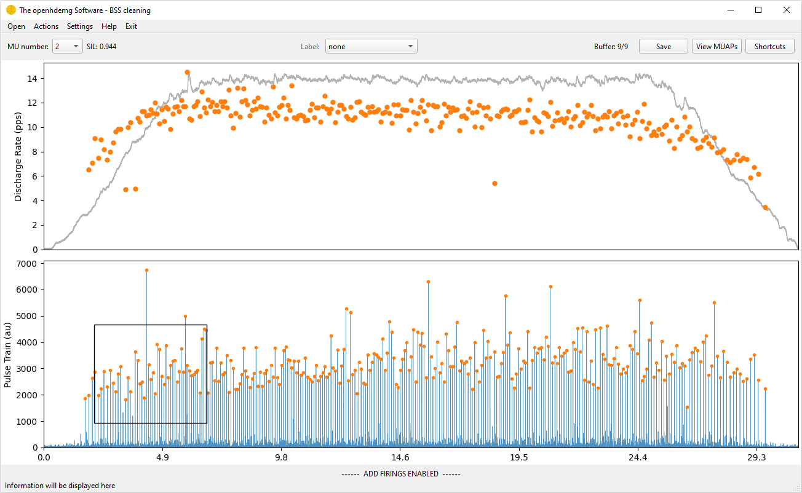

# Decomposition and Cleaning

Version 0.2.0 introduces a new decomposition workflow for extracting motor unit discharge times from raw HDsEMG signals.

The main components are:

- `ConvolutiveBSSParams`, a dataclass containing parameters for convolutive blind source separation;
- `convolutive_bss()`, the lower-level decomposition function;
- `EMGDecomposer`, a high-level pipeline that can filter, remove power-line harmonics, exclude bad channels, decompose, reconstruct an `emgfile`, and remove duplicate MUs;
- `select_bad_channels()`, a visual workflow for marking noisy channels;
- `remove_powerline_harmonics()`, an FFT-based function for suppressing harmonics of the selected mains frequency;
- `remove_duplicates_within()`, a within-file duplicate-removal function based on spike-train timing.

## Required Input

The high-level decomposer expects an `emgfile` with at least:

- `RAW_SIGNAL`, a pandas DataFrame with samples by channels;
- `FSAMP`, the sampling frequency in Hz.

```python
import openhdemg.library as emg

emgfile = emg.emg_from_samplefile()
print(emgfile.keys())
```

The sample file is already decomposed (it contains a few units), but it is still useful for learning the API structure.

## Mark Bad Channels

Before decomposition, inspect raw channels and mark noisy or unusable channels.

```python
import openhdemg.library as emg

emgfile = emg.askloadmodule()

emgfile = emg.select_bad_channels(emgfile=emgfile)
```

The selected information is stored in:

```python
emgfile["GOOD_CHANNELS"]
```

`EMGDecomposer` can use this key to exclude bad channels before decomposition.

## Configure Decomposition Parameters

Create a `ConvolutiveBSSParams` object and adjust the parameters needed for your recording.

```python
import openhdemg.library as emg

params = emg.ConvolutiveBSSParams()

params.n_iterations = 500
params.silhouette_threshold = 0.90
params.extension_factor = 16
params.min_spike_count = 10
```

Common parameters to review:

| Parameter | Meaning |
| --- | --- |
| `n_iterations` | Maximum number of source-extraction attempts. |
| `silhouette_threshold` | Minimum SIL required to accept a candidate MU. |
| `extension_factor` | Signal-extension factor used before blind source separation. |
| `rem_activity_index ` | Whether to remove all the identified spikes from the activity index to reduce re-detection of the same source. |
| `min_spike_count` | Minimum number of spikes required to accept a candidate MU. |

## Run the High-Level Pipeline

The simplest workflow is:

```python
import openhdemg.library as emg

emgfile = emg.emg_from_samplefile()

params = emg.ConvolutiveBSSParams()
params.n_iterations = 500
params.silhouette_threshold = 0.90

decomposer = emg.EMGDecomposer()
decomposer.set_decomposition_parameters(params)

decomposed_emgfile = decomposer.run_decomposition(emgfile)
```

By default, `EMGDecomposer`:

- applies band-pass filtering with order 2 and 20-500 Hz cut-offs;
- does not remove power-line harmonics unless notch parameters are set;
- excludes bad channels if `GOOD_CHANNELS` is present;
- runs `convolutive_bss()`;
- reconstructs the `emgfile` with decomposition outputs;
- removes duplicate MUs with default within-file duplicate-removal parameters.

## Configure Filtering

Change band-pass and power-line harmonic settings with `change_filtering_parameters()`.

```python
decomposer = emg.EMGDecomposer()

decomposer.change_filtering_parameters(
    bandpass_order=2,
    bandpass_lowcut=20,
    bandpass_highcut=500,
    notch_freq=50.0,
    notch_width=5.0,
)
```

For 60 Hz mains:

```python
decomposer.change_filtering_parameters(
    bandpass_order=2,
    bandpass_lowcut=20,
    bandpass_highcut=500,
    notch_freq=60.0,
    notch_width=5.0,
)
```

Disable all filtering:

```python
decomposer.change_filtering_parameters(
    bandpass_order=None,
    bandpass_lowcut=None,
    bandpass_highcut=None,
    notch_freq=None,
    notch_width=None,
)
```

## Configure Bad-Channel Exclusion

Bad-channel exclusion is enabled by default.

```python
decomposer.use_good_channels_only(True)
```

If `GOOD_CHANNELS` is absent, the decomposer warns and continues without excluding channels.

Disable bad-channel exclusion:

```python
decomposer.use_good_channels_only(False)
```

## Configure Duplicate Removal

Within-file duplicate removal is enabled by default but you can change its parameters. For example, you can make it more conservative by increasing peak_window_half_width:

```python
decomposer.change_duplicate_removal_parameters(
    correlation_max_lag=50e-3,
    peak_window_half_width=5e-3,
    duplicate_threshold=30,
    which="accuracy",
)
```

## Output Keys

After successful decomposition, the returned `emgfile` can include:

- `DECOMPOSITION_PARAMETERS`, containing method, filtering, bad-channel, and duplicate-removal settings;
- `NUMBER_OF_MUS`;
- `MUPULSES`;
- `IPTS`;
- `ACCURACY`;
- `BINARY_MUS_FIRING`.

If no MUs are detected, `NUMBER_OF_MUS` is set to `0` and MU-specific keys may be absent.

Always check:

```python
print(decomposed_emgfile.get("NUMBER_OF_MUS", 0))
print(decomposed_emgfile.get("DECOMPOSITION_PARAMETERS"))
```

## Plot and Inspect Results

```python
if decomposed_emgfile.get("NUMBER_OF_MUS", 0) > 0:
    emg.plot_mupulses(
        emgfile=decomposed_emgfile,
        addrefsig="REF_SIGNAL" in decomposed_emgfile,
        refsig_channel=0,
    )

    emg.plot_ipts(
        emgfile=decomposed_emgfile,
        show_markers=True,
    )
else:
    print("No MUs were detected.")
```

Use physiological criteria, source separation quality, discharge-rate behaviour, and visual inspection before accepting the output.

## Save the Decomposed File

Save the decomposed output as a binary module:

```python
emg.save_openhdemg_module(
    emgfile=decomposed_emgfile,
    path="C:/Users/.../Desktop/openhdemg_modules",
    module_name="participant_01_trial_01_decomposed",
)
```

## Direct Use of `convolutive_bss()`

Advanced users can call `convolutive_bss()` directly with an array shaped as channels by samples.

```python
import numpy as np
import openhdemg.library as emg

emgfile = emg.askloadmodule()

emgsig = np.transpose(
    emgfile["RAW_SIGNAL"].to_numpy(dtype=np.float64)
)

params = emg.ConvolutiveBSSParams()
params.n_iterations = 250

mupulses, ipts, sil = emg.convolutive_bss(
    emgsig=emgsig,
    fsamp=emgfile["FSAMP"],
    decomposition_params=params,
)
```

The direct function is useful for algorithm development. For routine workflows, `EMGDecomposer` is preferred because it reconstructs the `emgfile` and records processing metadata.

## Complete Example

```python
import openhdemg.library as emg

raw_emgfile = emg.askloadmodule()

raw_emgfile = emg.select_bad_channels(raw_emgfile)

params = emg.ConvolutiveBSSParams()
params.n_iterations = 250
params.silhouette_threshold = 0.90
params.min_spike_count = 20

decomposer = emg.EMGDecomposer()
decomposer.set_decomposition_parameters(params)
decomposer.change_filtering_parameters(
    bandpass_order=2,
    bandpass_lowcut=20,
    bandpass_highcut=900,
    notch_freq=50.0,
    notch_width=5.0,
)

decomposed_emgfile = decomposer.run_decomposition(raw_emgfile)

if decomposed_emgfile.get("NUMBER_OF_MUS", 0) > 0:
    emg.plot_mupulses(
        decomposed_emgfile,
        addrefsig="REF_SIGNAL" in decomposed_emgfile,
        refsig_channel=0,
    )

emg.asksavemodule(emgfile=decomposed_emgfile)
```

## Manual editing in the Software

The output of motor unit decomposition should never be accepted blindly. Before a decomposed file is used for analysis, the operator should carefully inspect the decomposition outcome and decide which motor units should be accepted, rejected, or manually edited.

This decision should be based on multiple checks, including physiological plausibility, discharge-pattern regularity, accuracy scores, visual inspection of the IPTS/source signal, MU firing behaviour, and consistency with the experimental task. Automatic metrics are extremely useful, but they cannot replace expert supervision.

For this reason, each decomposition outcome should undergo manual revision. When needed, the automatic result should be manually edited to maximise the accuracy and reliability of the subsequent analyses.

However, serious manual editing requires a dedicated infrastructure: interactive visualisation, fast navigation across motor units, editing tools for discharge times, cleaning utilities and quality-control panels. For this reason, manual editing is currently supported through the ***[openhdemg software](https://www.giacomovalli.com/openhdemg_software/){:target="_blank"}***.

The software can be downloaded ***[here](https://www.giacomovalli.com/openhdemg_software/){:target="_blank"}***.

A dedicated tutorial for the cleaning workflow will be added soon.



## More Questions?

If you need additional information, read the answers or ask a question in the [*openhdemg* discussion section](https://github.com/GiacomoValliPhD/openhdemg/discussions){:target="_blank"}. If you are not familiar with GitHub discussions, please read this [post](https://github.com/GiacomoValliPhD/openhdemg/discussions/42){:target="_blank"}.