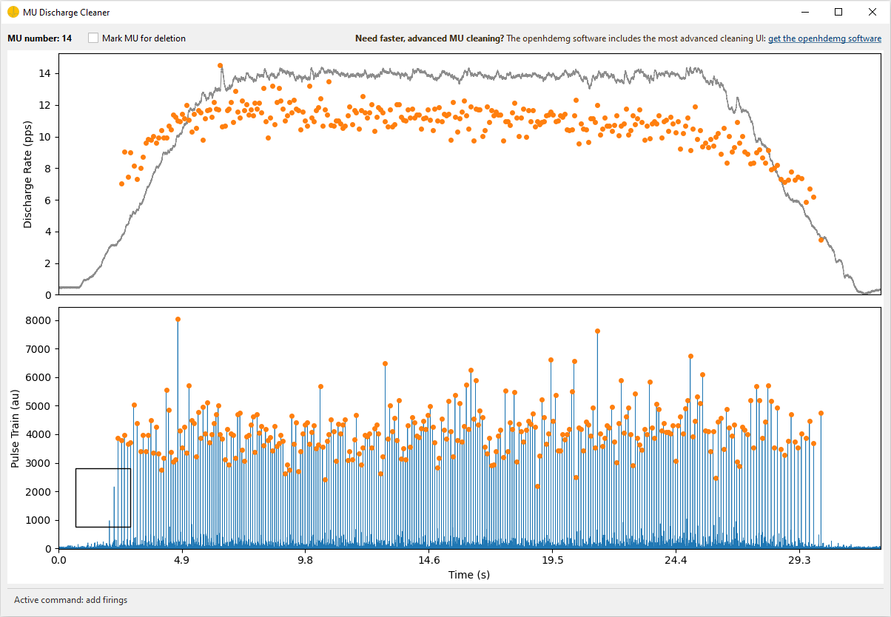

# Decomposition and Cleaning

Version 0.2.0 introduces a new decomposition workflow for extracting motor unit discharge times from raw HDsEMG signals.

The main components are:

- `ConvolutiveBSSParams`, a dataclass containing parameters for convolutive blind source separation;
- `convolutive_bss()`, the lower-level decomposition function;
- `EMGDecomposer`, a high-level pipeline that can filter, remove power-line harmonics, exclude bad channels, decompose, reconstruct an `emgfile`, and remove duplicate MUs;
- `select_bad_channels()`, a visual workflow for marking noisy channels;
- `run_bss_mu_editor()`, a lightweight UI for basic manual editing of BSS discharge selections;
- `remove_powerline_harmonics()`, an FFT-based function for suppressing harmonics of the selected mains frequency;
- `remove_duplicates_within()`, a within-file duplicate-removal function based on spike-train timing.

## Required Input

The high-level decomposer expects an `emgfile` with at least:

- `RAW_SIGNAL`, a pandas DataFrame with samples by channels;
- `FSAMP`, the sampling frequency in Hz.

```python
import openhdemg.library as emg

emgfile = emg.emg_from_samplefile()
print(emgfile.keys())
```

The sample file is already decomposed (it contains a few units), but it is still useful for learning the API structure.

## Mark Bad Channels

Before decomposition, inspect raw channels and mark noisy or unusable channels.

```python
import openhdemg.library as emg

emgfile = emg.askloadmodule()

emgfile = emg.select_bad_channels(emgfile=emgfile)
```

The selected information is stored in:

```python
emgfile["GOOD_CHANNELS"]
```

`EMGDecomposer` can use this key to exclude bad channels before decomposition.

## Configure Decomposition Parameters

Create a `ConvolutiveBSSParams` object and adjust the parameters needed for your recording.

```python
import openhdemg.library as emg

params = emg.ConvolutiveBSSParams()

params.n_iterations = 500
params.silhouette_threshold = 0.90
params.extension_factor = 16
params.min_spike_count = 10
```

Common parameters to review:

| Parameter | Meaning |
| --- | --- |
| `n_iterations` | Maximum number of source-extraction attempts. |
| `silhouette_threshold` | Minimum SIL required to accept a candidate MU. |
| `extension_factor` | Signal-extension factor used before blind source separation. |
| `rem_activity_index ` | Whether to remove all the identified spikes from the activity index to reduce re-detection of the same source. |
| `min_spike_count` | Minimum number of spikes required to accept a candidate MU. |

## Run the High-Level Pipeline

The simplest workflow is:

```python
import openhdemg.library as emg

emgfile = emg.emg_from_samplefile()

params = emg.ConvolutiveBSSParams()
params.n_iterations = 500
params.silhouette_threshold = 0.90

decomposer = emg.EMGDecomposer()
decomposer.set_decomposition_parameters(params)

decomposed_emgfile = decomposer.run_decomposition(emgfile)
```

By default, `EMGDecomposer`:

- applies band-pass filtering with order 2 and 20-500 Hz cut-offs;
- does not remove power-line harmonics unless `notch_enabled=True`;
- excludes bad channels if `GOOD_CHANNELS` is present;
- runs `convolutive_bss()`;
- reconstructs the `emgfile` with decomposition outputs;
- removes duplicate MUs with default within-file duplicate-removal parameters.

## Configure Filtering

Change band-pass and power-line harmonic settings with `change_filtering_parameters()`.

```python
decomposer = emg.EMGDecomposer()

decomposer.change_filtering_parameters(
    bandpass_enabled=True,
    bandpass_order=2,
    bandpass_lowcut=20,
    bandpass_highcut=500,
    notch_enabled=True,
    notch_freq=50.0,
    notch_width=5.0,
)
```

Disable all filtering:

```python
decomposer.change_filtering_parameters(
    bandpass_enabled=False,
    notch_enabled=False,
)
```

## Configure Bad-Channel Exclusion

Bad-channel exclusion is enabled by default.

```python
decomposer.use_good_channels_only(True)
```

If `GOOD_CHANNELS` is absent, the decomposer warns and continues without excluding channels.

Disable bad-channel exclusion:

```python
decomposer.use_good_channels_only(False)
```

## Configure Duplicate Removal

Within-file duplicate removal is enabled by default but you can change its parameters. For example, you can make it more conservative by increasing peak_window_half_width:

```python
decomposer.change_duplicate_removal_parameters(
    duplicate_removal_enabled=True,
    correlation_max_lag=50e-3,
    peak_window_half_width=5e-3,
    duplicate_threshold=30,
    which="accuracy",
)
```

## Output Keys

After successful decomposition, the returned `emgfile` can include:

- `DECOMPOSITION_PARAMETERS`, containing method, filtering, bad-channel, and duplicate-removal settings;
- `NUMBER_OF_MUS`;
- `MUPULSES`;
- `IPTS`;
- `ACCURACY`;
- `BINARY_MUS_FIRING`.

If no MUs are detected, `NUMBER_OF_MUS` is set to `0` and MU-specific keys may be absent.

Always check:

```python
print(decomposed_emgfile.get("NUMBER_OF_MUS", 0))
print(decomposed_emgfile.get("DECOMPOSITION_PARAMETERS"))
```

## Plot and Inspect Results

```python
if decomposed_emgfile.get("NUMBER_OF_MUS", 0) > 0:
    emg.plot_mupulses(
        emgfile=decomposed_emgfile,
        addrefsig="REF_SIGNAL" in decomposed_emgfile,
        refsig_channel=0,
    )

    emg.plot_ipts(
        emgfile=decomposed_emgfile,
        show_markers=True,
    )
else:
    print("No MUs were detected.")
```

Use physiological criteria, source separation quality, discharge-rate behaviour, and visual inspection before accepting the output.

## Save the Decomposed File

Save the decomposed output as a binary module:

```python
emg.save_openhdemg_module(
    emgfile=decomposed_emgfile,
    path="C:/Users/.../Desktop/openhdemg_modules",
    module_name="participant_01_trial_01_decomposed",
)
```

## Direct Use of `convolutive_bss()`

Advanced users can call `convolutive_bss()` directly with an array shaped as channels by samples.

```python
import numpy as np
import openhdemg.library as emg

emgfile = emg.askloadmodule()

emgsig = np.transpose(
    emgfile["RAW_SIGNAL"].to_numpy(dtype=np.float64)
)

params = emg.ConvolutiveBSSParams()
params.n_iterations = 250

mupulses, ipts, sil = emg.convolutive_bss(
    emgsig=emgsig,
    fsamp=emgfile["FSAMP"],
    decomposition_params=params,
)
```

The direct function is useful for algorithm development. For routine workflows, `EMGDecomposer` is preferred because it reconstructs the `emgfile` and records processing metadata.

## Complete Example

```python
import openhdemg.library as emg

raw_emgfile = emg.askloadmodule()

raw_emgfile = emg.select_bad_channels(raw_emgfile)

params = emg.ConvolutiveBSSParams()
params.n_iterations = 250
params.silhouette_threshold = 0.90
params.min_spike_count = 20

decomposer = emg.EMGDecomposer()
decomposer.set_decomposition_parameters(params)
decomposer.change_filtering_parameters(
    bandpass_enabled=True,
    bandpass_order=2,
    bandpass_lowcut=20,
    bandpass_highcut=900,
    notch_enabled=True,
    notch_freq=50.0,
    notch_width=5.0,
)

decomposed_emgfile = decomposer.run_decomposition(raw_emgfile)

if decomposed_emgfile.get("NUMBER_OF_MUS", 0) > 0:
    emg.plot_mupulses(
        decomposed_emgfile,
        addrefsig="REF_SIGNAL" in decomposed_emgfile,
        refsig_channel=0,
    )

emg.asksavemodule(emgfile=decomposed_emgfile)
```

## Lightweight BSS MU Editor

For small manual corrections, openhdemg also provides a lightweight cleaning UI through `run_bss_mu_editor()`. This editor can display the discharge-rate/IPTS traces, add or remove discharge times, recompute the current MU source using a user-provided extended, centered, and whitened signal, and mark MUs that should be deleted later.

!!! note "Advanced MU cleaning"
    The most advanced MU cleaning tools are available in the ***[openhdemg software](https://www.giacomovalli.com/openhdemg_software/){:target="_blank"}***. The software provides the dedicated cleaning environment for extensive manual review and should be preferred when advanced editing, quality-control panels, and a more complete interactive workflow are required.

The editor should be called through `run_bss_mu_editor()` rather than by instantiating the widget directly. The runner manages the Qt application and returns:

- `edited_emgfile`, with manually edited `MUPULSES` and, when the `W` command is used, updated `IPTS`;
- `mus_to_delete`, a list of MU indexes marked for deletion in the UI.

The editor does not delete marked MUs and does not finalise derived fields such as `ACCURACY`/SIL or `BINARY_MUS_FIRING`. These steps should be performed in the calling script after the UI closes.

Prepare the preprocessed, extended, centered, and whitened signal in the
calling script, then open the cleaning UI.

Import needed modules

```python
import numpy as np
import pandas as pd
import openhdemg.library as emg
from openhdemg.ui import run_bss_mu_editor
```

Load openhdemg module decomposed using EMGDecomposer

```python
emgfile = emg.askloadmodule()
```

Extract needed decomposition parameters

```python
decomp_params = emgfile["DECOMPOSITION_PARAMETERS"]
extension_factor = int(decomp_params["extension_factor"])
eigenvalue_percentile = float(decomp_params["eigenvalue_percentile"])
```

Rebuild the same signal used by the decomposition preprocessing pipeline.
The prepared signal will only be used for cleaning and will not update the
original emgfile.

```python
working_emgfile = emgfile
bandpass_params = decomp_params["bandpass_filtering"]
if bandpass_params["enabled"] is True:
    working_emgfile = emg.filter_rawemg(
        emgfile=working_emgfile,
        order=bandpass_params["order"],
        lowcut=bandpass_params["lowcut"],
        highcut=bandpass_params["highcut"],
    )
```

Extract the EMG signal and store it as an array with channels as rows,
samples as columns.

```python
emg_sig = working_emgfile["RAW_SIGNAL"].to_numpy(dtype=np.float64).T
```

Apply power-line harmonics removal when it was used during decomposition.

```python
powerline_params = decomp_params["powerline_harmonics"]
if powerline_params["enabled"] is True:
    emg_sig = emg.remove_powerline_harmonics(
        sig=emg_sig,
        fsamp=emgfile["FSAMP"],
        notch_freq=powerline_params["notch_freq"],
        notch_width=powerline_params["notch_width"],
    )
```

Remove bad channels when this was used during decomposition.

```python
if decomp_params["exclude_bad_channels"] is True:
    good_channels = emgfile.get("GOOD_CHANNELS", None)
    if good_channels is not None:
        good_idx = sorted(
            int(ch) for ch, ok in good_channels.items() if ok
        )
        emg_sig = emg_sig[good_idx, :]
```

Prepare the extended, centered, and whitened signal.

```python
e_sig = emg.extend_emg_signal(
    sig=emg_sig,
    ext_fact=extension_factor,
)
e_sig = e_sig - np.mean(e_sig, axis=1, keepdims=True)
e_w_sig = emg.svd_whitening(
    e_sig=e_sig,
    eigenvalue_percentile=eigenvalue_percentile,
)
```

Align with the original sample indexes used by MUPULSES/IPTS

```python
e_w_sig = np.pad(
    e_w_sig,
    ((0, 0), (extension_factor, 0)),
    mode="constant",
    constant_values=0,
)
```

Start the editor

```python
edited_emgfile, mus_to_delete = run_bss_mu_editor(
    emgfile=emgfile,
    e_w_sig=e_w_sig,
    refsig_channel=0,
)
```



Once editing is completed, delete MUs marked in the UI

```python
if mus_to_delete:
    edited_emgfile = emg.delete_mus(
        edited_emgfile,
        munumber=mus_to_delete,
        if_single_mu="remove",
    )
```

Also check for duplicate MUs that might have emerged from manual editing, if
duplicate removal is enabled in the decomposition metadata.

```python
duplicate_params = decomp_params["duplicate_removal"]
if duplicate_params["enabled"] is True:
    edited_emgfile = emg.remove_duplicates_within(
        emgfile=edited_emgfile,
        correlation_max_lag=duplicate_params["correlation_max_lag"],
        peak_window_half_width=duplicate_params["peak_window_half_width"],
        duplicate_threshold=duplicate_params["duplicate_threshold"],
        which=duplicate_params["which"],
    )
```

Recalculate SIL for all remaining MUs.

```python
sil_values = []
for mu in range(edited_emgfile["NUMBER_OF_MUS"]):
    sil = emg.compute_sil(
        ipts=edited_emgfile["IPTS"][mu],
        mupulses=edited_emgfile["MUPULSES"][mu],
        compute_on_peaks_only=True,
    )
    sil_values.append(sil)
edited_emgfile["ACCURACY"] = pd.DataFrame(sil_values)
```

Recalculate binary MU firings.

```python
edited_emgfile["BINARY_MUS_FIRING"] = emg.create_binary_firings(
    emg_length=edited_emgfile["EMG_LENGTH"],
    number_of_mus=edited_emgfile["NUMBER_OF_MUS"],
    mupulses=edited_emgfile["MUPULSES"],
)
```

Standardise emgfile dtypes and save the emgfile.

```python
edited_emgfile = emg.standardise_emgfile_dtypes(emgfile=edited_emgfile)
emg.asksavemodule(emgfile=edited_emgfile)
```

## Advanced Manual Editing in the Software

The output of motor unit decomposition should never be accepted blindly. Before a decomposed file is used for analysis, the operator should carefully inspect the decomposition outcome and decide which motor units should be accepted, rejected, or manually edited.

This decision should be based on multiple checks, including physiological plausibility, discharge-pattern regularity, accuracy scores, visual inspection of the IPTS/source signal, MU firing behaviour, and consistency with the experimental task. Automatic metrics are extremely useful, but they cannot replace expert supervision.

For this reason, each decomposition outcome should undergo manual revision. When needed, the automatic result should be manually edited to maximise the accuracy and reliability of the subsequent analyses.

However, serious manual editing requires a dedicated infrastructure: interactive visualisation, fast navigation across motor units, editing tools for discharge times, cleaning utilities and quality-control panels. The lightweight library editor is useful for basic edits, but the most advanced cleaning workflow is provided by the ***[openhdemg software](https://www.giacomovalli.com/openhdemg_software/){:target="_blank"}***.

The software can be downloaded ***[here](https://www.giacomovalli.com/openhdemg_software/){:target="_blank"}***.

A dedicated tutorial for the cleaning workflow will be added soon.


## More Questions?

If you need additional information, read the answers or ask a question in the [*openhdemg* discussion section](https://github.com/GiacomoValliPhD/openhdemg/discussions){:target="_blank"}. If you are not familiar with GitHub discussions, please read this [post](https://github.com/GiacomoValliPhD/openhdemg/discussions/42){:target="_blank"}.
