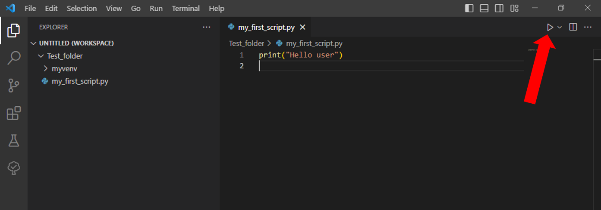

## Introduction

Welcome to the tutorial on setting up your working environment.

This is the first step necessary to start using *openhdemg*, both if you want to use the library's functions and develop your scripts, or if you only want to use the [graphical user interface (GUI)](../gui_intro.md).

The working environment refers to the set of resources necessary to carry out a particular task or job. In the context of this tutorial, we refer to the combination of a computer, a programming language, an integrated development environment and a set of algorithms.

In order to use *openhdemg*, we will install the following:

- Programming language: Python 3
- Integrated development environment: Visual Studio Code
- Set of algorithms: *openhdemg*

Python 3 is a powerful and versatile programming language known for its simplicity, readability, and extensive library support. With a focus on code readability, Python allows developers to express concepts in fewer lines of code compared to other programming languages. It is widely used for web development, scientific computing, data analysis, artificial intelligence, and more.

The integrated development environment is a software that facilitates to write, test, and debug code. In this tutorial we will use Visual Studio Code (VS Code), a popular code editor that provides a seamless experience for Python programming.

By following the steps outlined in this tutorial, you will be able to install Python, set up VS Code, and configure your environment to write clean and efficient Python code.


## Install Python and VS Code on Windows

To install Python 3 on Windows:

1. Visit the official Python website: [https://www.python.org/downloads/](https://www.python.org/downloads/){:target="_blank"}
2. Click on the "Downloads" tab.
3. Scroll down to the section titled "Python Releases for Windows."
4. Click on the "Download" button for the latest version of Python (e.g., Python 3.11.4).
5. Run the downloaded installer.
6. On the installer, make sure to check the box "Add Python to PATH" and then click "Install Now."
7. Python will be installed to your system (optionally, you can verify the installation by opening a command prompt and typing python --version).

To install VS Code on Windows:

1. Visit the official Visual Studio Code website: [https://code.visualstudio.com/](https://code.visualstudio.com/){:target="_blank"}
2. Click on the "Download for Windows" button.
3. Once the download is complete, run the installer.
4. Follow the instructions on the installer to complete the installation.
5. Visual Studio Code will be installed to your system.

## Install Python and VS Code on Mac

To install Python 3 on Mac:

1. Visit the official Python website: [https://www.python.org/downloads/](https://www.python.org/downloads/){:target="_blank"}
2. Click on the "Downloads" tab.
3. Scroll down to the section titled "Python Releases for macOS."
4. Click on the "Download" button for the latest version of Python (e.g., Python 3.11.4).
5. Run the downloaded installer package.
6. Follow the instructions on the installer to complete the installation.
7. Python will be installed to your system. (optionally, you can verify the installation by opening a terminal and typing python3 --version).

To install VS Code on Mac:

1. Visit the official Visual Studio Code website: [https://code.visualstudio.com/](https://code.visualstudio.com/){:target="_blank"}
2. Click on the "Download for Mac" button.
3. Once the download is complete, open the downloaded .dmg file.
4. Drag and drop the Visual Studio Code application into the "Applications" folder.
5. Visual Studio Code will be installed to your system.

## Configure VS Code for Python:

Now that VS Code is installed, you need to set it up to code in Python and to install *openhdemg*:

1. Open Visual Studio Code.
2. Install the "Python" extension by Microsoft. To do so, click on the Extensions view on the left sidebar, search for "Python" in the search bar, and click the "Install" button next to the "Python" extension by Microsoft.


Once the extension is installed, you need to create a folder where you will place all the scripts that you will write. You can create this folder with any name an in any location in your computer, but make it simple to find! In this tutorial the folder was placed in the Desktop and named `Test_folder`.

Once the folder is created:

1. In VS Code click on 'File' and then on 'Add Folder to Workspace'.
2. In VS Code click on 'Terminal' and then on 'New Terminal'.
3. Select your folder in the window that pops up.


With your powershell terminal that is **pointing to your folder path**, you can now create a Virtual environment.

## Create a Virtual environment

The Virtual environments provide an isolated and controlled environment for your Python projects, allowing you to manage project-specific dependencies effectively.

In order to create a virtual environment type in your terminal:

For Windows users:
```shell
python -m venv myvenv
```

For Mac users:
```shell
python3 -m venv myvenv  
```


This command will create a Virtual environment named `myvenv`.

To activate `myvenv` type in the terminal:

For Windows users:
```shell
myvenv/Scripts/Activate   
```

For Mac users:
```shell
source myvenv/bin/activate  
```


If everything was successful, you should see the colourful name of your Virtual environment to the left of your folder path (as in the figure above).

Great! You are all set up to install and use *openhdemg*.

## Install and use *openhdemg*

Now, installing *openhdemg* is super simple. Just type in the terminal:

```shell
pip install openhdemg 
```

*openhdemg* will be installed. Once the installation process is completed, you will see in the terminal the message `Successfully installed openhdemg`.

If you want to use the GUI, type in the terminal:

```shell
python -m openhdemg.gui.openhdemg_gui
```

And the GUI will start:


If you instead want to write your own script using the functions contained in *openhdemg*, follow these steps:

1. click on the Explorer view on the left sidebar.
2. Click on the icon to create a new file in your workspace folder (`Test_folder` in this case).
3. Name the file as you wish but with a .py extension.


Now you can open your .py file, write your code and execute it.



## Troubleshooting

### Python Installation Issues
Windows:

- Make sure you are running the installer with administrative privileges.
- Verify that the downloaded Python installer matches the architecture of your Windows system (32-bit or 64-bit).
- If the installation fails, try downloading a different version of Python from the official Python website.

macOS:

- Ensure you have the necessary permissions to install software on your Mac.
- If the installation fails, try using a package manager like Homebrew to install Python instead. Instructions for Homebrew installation can be found on the Homebrew website.

### Issues in the activation of the Virtual environment

Windows:

If trying to activate the Virtual environment you see this (or a similar) message in the terminal:

```
the execution of scripts is disabled on this system
```

the problem might be due to the Execution Policy Settings that are too restrictive and do not allow you to execute scripts. This problemm can be solved with the following steps:

1. Go to the Windos search bar.
2. Type PowerShell and open it as Administrator.
3. In the new PowerShell type:

```shell
Set-ExecutionPolicy Unrestricted -Force
```

This should solve the issue and you should now be able to activate your Virtual environment. For additional information on this topic visit the [stackoverflow thread](https://stackoverflow.com/questions/18713086/virtualenv-wont-activate-on-windows){:target="_blank"}.

### *openhdemg* Installation Issues

Windows:

If trying to install *openhdemg* via pip you see this (or a similar) message in the terminal:

```
ImportError: DLL load failed while importing _cext: The specified module could not be found.
```

the problem might be that you do not have the necessary Visual C++ Redistributable. This can be simply solved by visitng the [Microsoft website](https://learn.microsoft.com/en-US/cpp/windows/latest-supported-vc-redist?view=msvc-170){:target="_blank"} and dowloading and installing the latest Visual Studio 2015, 2017, 2019 and 2022 redistributable. Please note, this is a single redistributable, you don't need to perform multiple dowloads. This should solve the issue and you should now be able to pip install *openhdemg*. If that's not the case, continue reading.

## More questions?

We hope that this tutorial was useful. If you need any additional information, do not hesitate to read the answers or ask a question in the [*openhdemg* discussion section](https://github.com/GiacomoValliPhD/openhdemg/discussions){:target="_blank"}. If you are not familiar with GitHub discussions, please read this [post](https://github.com/GiacomoValliPhD/openhdemg/discussions/42){:target="_blank"}. This will allow the *openhdemg* community to answer your questions.
